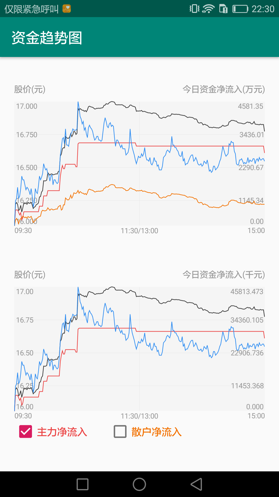

# StockView
[](https://jitpack.io/#yangsanning/StockView)


## 效果预览

| FenShiView                      | CapitalView                     | MiniFenShiView                  |
| ------------------------------- | ------------------------------- | ------------------------------- |
|  |  |  |


## 主要文件
| 名字             | 摘要           |
| ---------------- | -------------- |
|FenShiView | 普通分时图  |
|CapitalView | 资金趋势图  |
|MiniFenShiView | 迷你分时图  |


### 1. 基本用法

#### 1.1 布局中添加
```android
 <ysn.com.stock.view.FenShiView
        android:id="@+id/main_activity_fen_shi_view1"
        android:layout_width="match_parent"
        android:layout_height="230dp" />
```

#### 1.2 设置数据
```android
  fenShiView.setData(fenShi);
```


### 2. 配置属性([Attributes](https://github.com/yangsanning/StockView/blob/master/stock/src/main/res/values/attrs.xml))

#### CapitalView
|name|format|description|
|:---:|:---:|:---:|
| cv_in_flow_unit | integer | 净流入单位 |
| cv_in_flow_digits | integer | 净流入保留的位数 |
| cv_price_digits | integer | 价格保留的位数 |
| cv_left_title | string | 左上角标题(用于标注左边价格坐标) |
| cv_right_title | string | 右上角标题(用于标注右边inFlow坐标) |
| cv_price_color | color | 价格曲线颜色 |
| cv_finance_in_flow_color | color | 总资金净流入曲线颜色 |
| cv_main_in_flow_color | color | 主力净流入曲线颜色 |
| cv_retail_in_flow_color | color | 散户净流入曲线颜色 |
| cv_text_color | color | 文本颜色 |
| cv_bg_color | color | 背景颜色 |
| cv_column_line_color | color | 竖线颜色 |
| cv_row_line_color | color | 横线颜色 |

#### MiniFenShiView
|name|format|description|
|:---:|:---:|:---:|
| mfsv_up | color | 跌颜色 |
| mfsv_down | color | 跌颜色 |
| mfsv_equal | color | 不涨不跌颜色 |
| mfsv_gradient_bottom | color | 渐变底部颜色 |
| mfsv_stroke_width | dimension | 线宽 |
| mfsv_alpha | integer | 包裹区域的透明度 |
| mfsv_dotted_line_width | dimension | 昨日收盘价虚线的宽度 |
| mfsv_dotted_line_space | dimension | 昨日收盘价虚线的跨度 |


### 3.添加方法

#### 3.1 添加仓库

在项目的 `build.gradle` 文件中配置仓库地址。

```android
allprojects {
	repositories {
		...
		maven { url 'https://jitpack.io' }
	}
}
```

#### 3.2 添加项目依赖

在需要添加依赖的 Module 下添加以下信息，使用方式和普通的远程仓库一样。

```android
implementation 'com.github.yangsanning:StockView:1.0.5'
```
